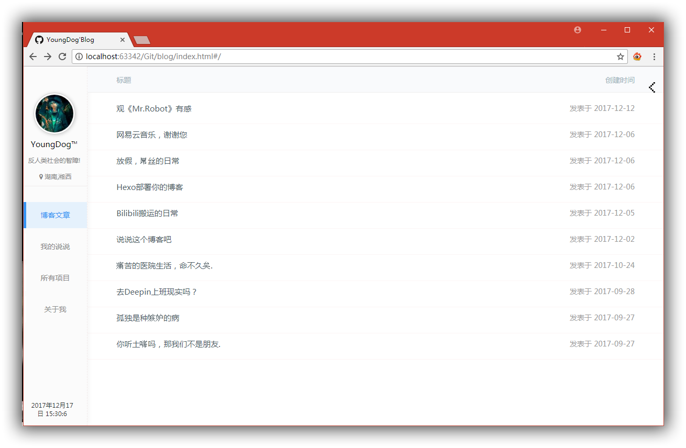

# 关于这个博客

写博客只是记录自己的开发记录,还有生活

从一开始有自己写一个博客的的想法，自己当时只为写出一个用来记录的日常的生活

苦与乐，快乐与否，开心与否，并记录在此，若干年后，自己重新打开博客的时候，会看到自己的以前的生活

做一个会生活的，学会生活，高质量的生活，

所以这个博客还是主要是功能不是好看的ＵＩ，自从上次写了个好看的ＵＩ，一发不可收拾

沉迷于ＵＩ，无法自拔

所以，我会把我功能性的东西写好

现在起，加油吧，少年，然后你已经不少年了

你已经从昨天(12/06)日的时候不是一位16岁的少年了，

而是一个１７岁的少年了，你已经不小了，该为自己的梦想而奋斗了．

说一下我现在的技术

> HTML   = 50%

> CSS    = 40%

> JS     = 0%

> GIT    = 60%

> PS     = 80%

> NodeJS = 0%

说一下我现在的梦想

> 活出自己想要活出来的样子

# Link

- Github: [chenhonzhou](http://github.com/chenhonzhou)

- TXQQ:   [2915537708](tencent://AddContact/?fromId=50&fromSubId=1&subcmd=all&uin=2915537708)

- Email: [chenhonzhou@gmail.com](https://www.google.com/gmail)

- V2EX:  [chenhonzhou](https://www.v2ex.com/member/chenhonzhou)

- bilibili: [HardDeams](https://space.bilibili.com/27013266/#/)

- zhihu: [陈宏洲不是NPC](https://www.zhihu.com/people/ChenHonZhouRemix/activities)

- 网易云: [HardDeams](http://music.163.com/#/user/home?id=266341607)

## 部署方法

 - Fork 本项目，然后再新建一个用于存放 blog（issues）的 repo。 （fork 的项目是没有 issue 的，所以得新建个项目）

 - 修改 gh-pages 分支下根目录的 config.js，填写好对应的博客名称，你自己的 github 用户名、对应项目名、多说 ID，保存。多说账号在这里申请http://duoshuo.com/

            var _config = {
                blog_name : '用于演示的博客',  // 博客名称
                owner: 'lifesinger',          // github 用户名
                repo: 'lifesinger.github.com',// 用于存放 blog（issues）的项目名
                duoshuo_id : 'hello1234',     // 在第三方评论插件多说申请站点的子域名
                // access_token: '',          // 请求量大时需要在 github 后台单独设置一个读取公开库的 token
                per_page: '15'                // 默认一页显示几篇文章
            }
